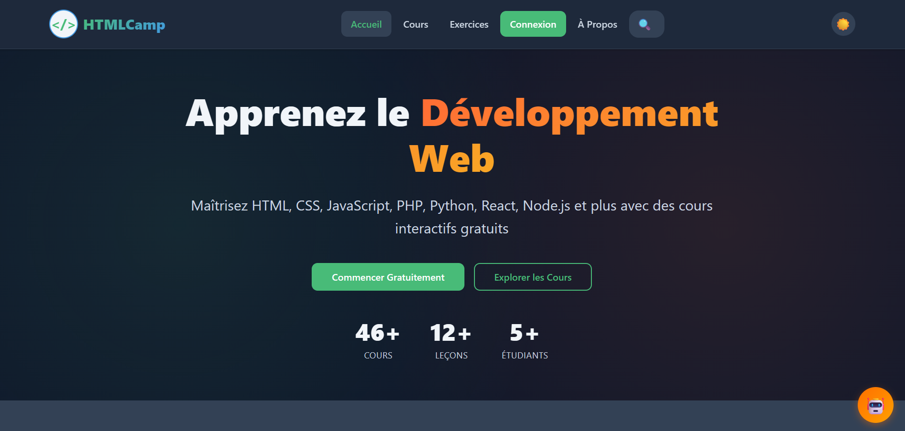
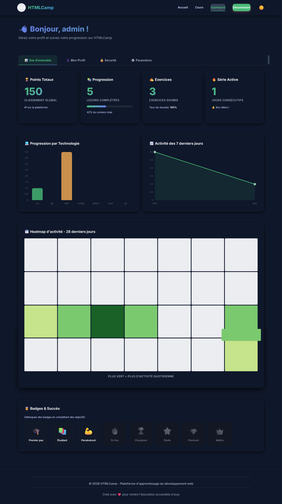
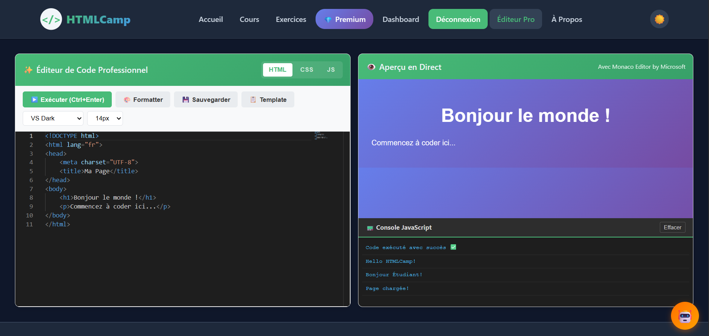
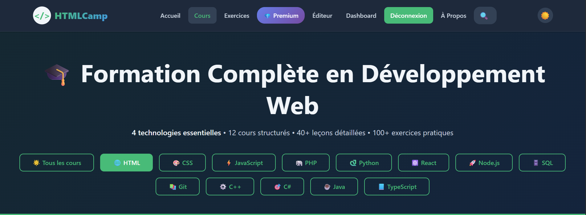
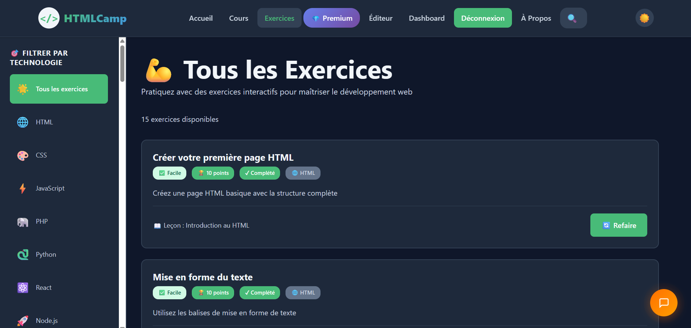
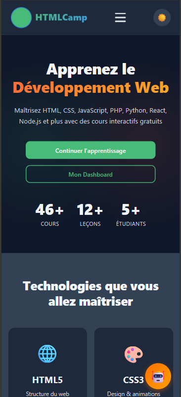

# Screenshots

Visual showcase of HTMLCamp's features and user interface.

> **💡 See it live**: [htmlcamp.free.nf](https://htmlcamp.free.nf/)

All screenshots below are from the actual live platform.

---

## Homepage

The landing page featuring course overview, technology cards, and quick navigation to learning paths.

**Features Shown**:
- Modern, clean design
- Technology category cards
- Quick statistics
- Call-to-action buttons

---

## Dashboard Analytics

Comprehensive learning analytics dashboard with interactive visualizations.

**Features Shown**:
- Progress overview cards
- Technology-specific completion charts (Chart.js)
- 28-day activity heatmap
- Weekly learning trends
- Streak counter
- Global leaderboard position
- Personalized insights and recommendations

---

## Monaco Code Editor

Professional-grade code editing environment powered by VS Code's Monaco Editor.

**Features Shown**:
- Syntax highlighting for multiple languages
- Auto-completion and IntelliSense
- Code minimap
- Integrated JavaScript console
- Live code preview
- Dark theme support
- Line numbers and error indicators
- Multi-file editing tabs

---

## AI Chat Assistant

Intelligent coding help powered by CodeLlama AI model.

**Features Shown**:
- Real-time chat interface
- Code block rendering with syntax highlighting
- Context-aware responses
- Conversation history
- Typing indicators
- Error handling
- Markdown support

---

## Course Catalog

Organized learning paths across 9 web development technologies.

**Features Shown**:
- Technology filtering
- Difficulty level indicators
- Course cards with descriptions
- Progress indicators
- Star ratings
- Lesson count
- Estimated completion time
- Enrollment status

---

## Exercise System

Interactive coding challenges with instant feedback.

**Features Shown**:
- Multiple choice questions
- Code completion challenges
- Live code validation
- Hint system
- Solution checking
- Points and XP rewards
- Progress tracking
- Detailed explanations

---

## User Profile

Personalized user profile with achievements and statistics.

**Features Shown**:
- User avatar and bio
- Badge collection
- Achievement showcase
- Learning statistics
- Contribution graph
- Technology expertise levels

---

## Lesson View

Interactive lesson interface with rich content and code examples.

**Features Shown**:
- Markdown content rendering
- Syntax-highlighted code blocks
- Copy-to-clipboard functionality
- Navigation between lessons
- Completion tracking
- Bookmark functionality
- Next lesson suggestion

---

## Mobile Responsive

Fully responsive design for seamless mobile learning.

**Features Shown**:
- Touch-optimized interface
- Collapsible navigation
- Adaptive layouts
- Mobile-friendly editor
- Gesture support

---

## Screenshots Guidelines

### Adding New Screenshots

1. **Resolution**: 1920x1080 (desktop) or 375x812 (mobile)
2. **Format**: PNG with transparency where appropriate
3. **File Size**: Optimize to under 500KB
4. **Naming**: Use kebab-case (e.g., `ai-chat-assistant.png`)

### Screenshot Standards

- Clean browser UI (hide extensions, bookmarks)
- Realistic but anonymized data
- Consistent theme (dark mode for editor, light for general)
- Show actual features, not mockups
- Include loading states where relevant

---

*Note: Screenshots showcase actual platform features and functionality. Some data has been anonymized for privacy.*
